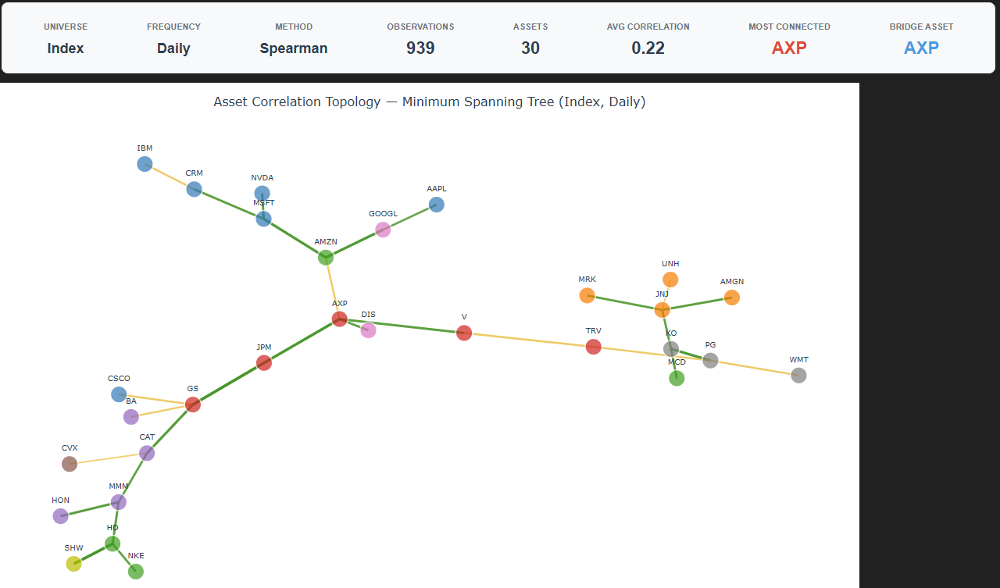
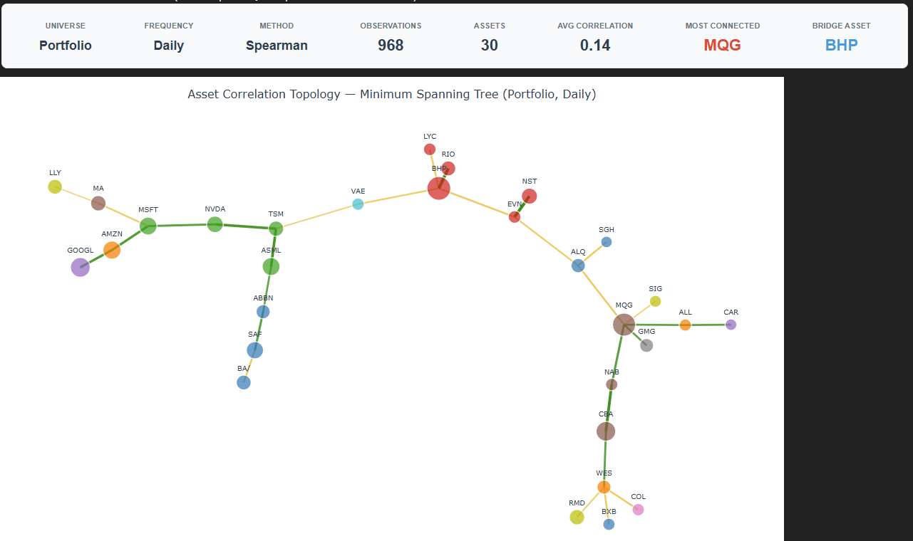
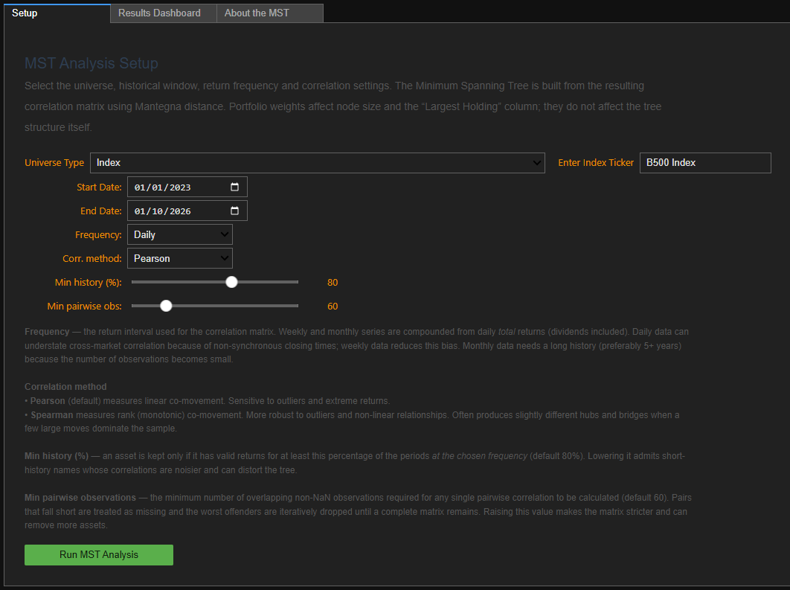

# Asset Correlation Topology — Minimum Spanning Tree (MST)

> Interactive Minimum Spanning Tree of asset correlations — reveals clusters, hubs and bridge assets in any index, fund or portfolio. Built for Bloomberg BQuant.

## About

Visualise the **structural skeleton** of asset correlations using a Minimum Spanning Tree.

Instead of staring at a dense correlation matrix, this tool turns historical returns into an interactive network. Each asset is a node; the strongest relationships become the edges that keep the whole universe connected. The result immediately reveals:

- Natural clusters (often sector-aligned, sometimes surprising)
- Hub assets (most connected)
- Bridge assets (the critical links that join otherwise separate groups)
- Cross-sector relationships that are easy to miss in a heatmap

Built for Bloomberg BQuant (BQNT). **Requires a Bloomberg Terminal / BQuant licence** — data is pulled via `bql` and `bquant.portfolio`, which are not publicly installable.

*Dow Jones Industrial Average, daily Spearman correlations. Node colour = GICS sector.*

## What you can do with it

| Use case | Why it helps |
|----------|--------------|
| Portfolio construction | See which names are true diversifiers vs. hidden correlated clusters |
| Risk management | Identify bridge assets whose removal would fragment the correlation structure |
| Sector / factor research | Spot when “different” sectors are actually tightly linked through a few names |
| Regime monitoring | Re-run across different windows or frequencies to watch the topology evolve |
| Client / IC communication | Replace a 50×50 correlation matrix with a single readable picture |

---

## How it works (short version)

1. Pull total returns for the chosen universe (Index, Fund, Portfolio, Ticker list, or macro set).
2. Optionally compound to weekly or monthly frequency.
3. Filter assets that lack sufficient history.
4. Build a Pearson or Spearman correlation matrix (with a minimum pairwise-observation threshold).
5. Convert correlations to Mantegna distance:  
   \( d_{ij} = \sqrt{2(1-\rho_{ij})} \)
6. Extract the Minimum Spanning Tree (exactly \( N-1 \) edges for \( N \) assets).
7. Compute node degree (most-connected) and node betweenness (bridge assets).
8. Layout the tree with a force-directed algorithm that only attracts along MST edges.
9. Colour by GICS sector, size by portfolio weight (when available).

---

## Example: a portfolio

*When a Portfolio is selected, node size reflects portfolio weight.*

---

## Key controls

- **Frequency** — Daily / Weekly / Monthly (weekly often reduces non-synchronous trading noise)
- **Correlation method** — Pearson (linear) or Spearman (rank / more robust to outliers)
- **Min history %** — Drop assets that are missing too much of the sample
- **Min pairwise observations** — Require a minimum number of overlapping points for any correlation (default 60; lower for weekly/monthly)

---

## Getting started

1. Open the notebook in Bloomberg BQNT (it needs `bql`, `bquant.portfolio`, `ipywidgets`, `plotly`, `scipy`, `pandas`, `numpy` and the supplied `custom_widgets.py` in the same folder).
2. Select universe, dates and settings on the **Setup** tab.
3. Click **Run MST Analysis**.
4. Explore the interactive Plotly chart and the sector summary table on the **Results** tab.
5. Read the **About the MST** tab for the full methodology.

*The Setup tab: choose a universe (Index, Fund, Ticker List, Global Macro Movers or Portfolio), date range and correlation settings, then click Run.*

---

## Limitations & design choices

- The tree shows only the *strongest* links. Weaker but still economically meaningful relationships are hidden (a natural next step is to overlay secondary edges).
- Node size reflects portfolio weight when a Portfolio is selected; otherwise nodes are equal-sized.
- “Largest Holding” in the sector table is only meaningful for portfolios.
- Weekly and monthly series are compounded from daily total returns to keep a consistent total-return definition.

---

## Roadmap / next practical advances

This is intentionally a clean starting point. The most useful extensions for portfolio managers are:

1. **Secondary / residual edges** — Draw the next-strongest links as dashed lines so you can see the “almost bridges”.
2. **Risk-contribution overlay** — Size or colour nodes by marginal contribution to portfolio risk (or residual risk after the MST structure is removed).
3. **Rolling / regime MSTs** — Animate or compare the tree across successive windows to watch hubs and bridges change.
4. **Portfolio vs Benchmark comparison** — Side-by-side or difference view.

Pull requests and ideas welcome.

---

## Licence

MIT — see [LICENSE](LICENSE). Requires a Bloomberg licence to run; no Bloomberg data is included in this repository.
